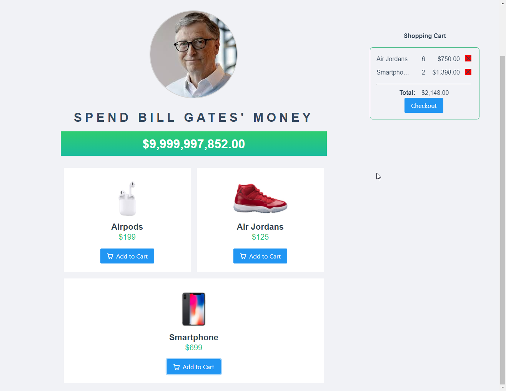
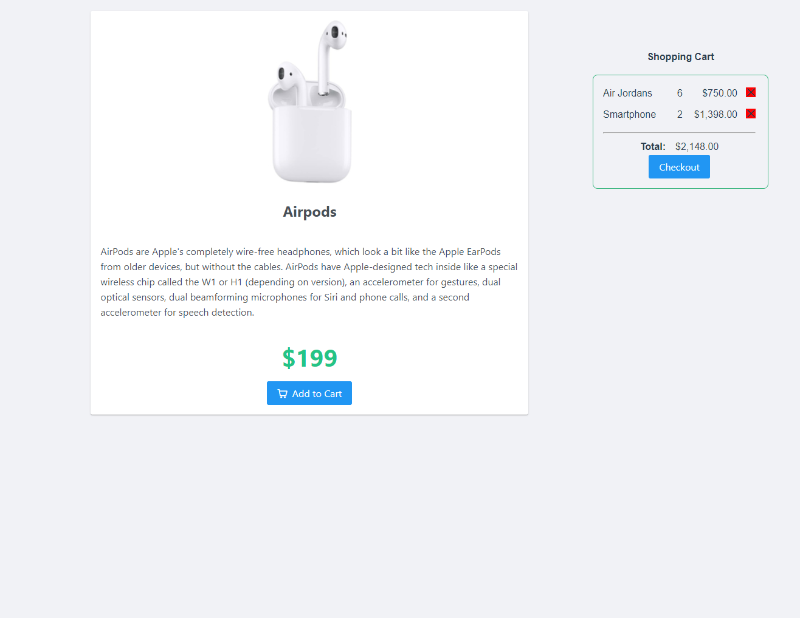
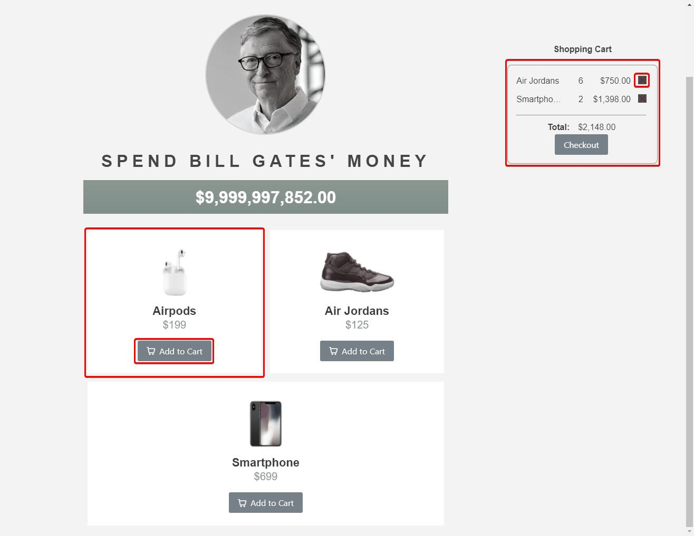

# Vue.js Workshop Challenge

Thanks for joining the first session of the Vue.js workshop, we were all together to learn some basics about Vue.js, how to define components, how to get started with this new language. In this challenge, we will step by step finish a very small app. So let's do it.

## Spending money app
Here is the app we're going to build with 2 pages and the following features:
* **First page** (Product list):
  * *Display all the products*, each product item has *add to cart button*. 
  * When an item is added to the cart, *display it on the shopping cart*.
  * Items in the cart can be removed.
  * *Cart total* must be updated after cart items change (item add / item remove)
* When clicking a product in the product list, the app should navigate to **second page** (Product detail):
  * *Display product detail* & shopping cart.  

  


## Setup workspace
### Checkout code at repository: 
https://github.com/aavn-ct-workshop/spending-money-challenge  
Checkout the corresponding branch belong to your team. (team1, team2, team3, team4)

### Account for testing: *test1/test1, test2/test2*

### Project structure
The Workshop Team was initialized the project for you, you can follow Vue's official documentation & project READ ME to start developing.
```
/
    src/
        components/         # component definitions. e.g: ShoppingCart.vue, ProductDetail.vue,..
        store/              # manage states of the app using VueX. Read more at https://vuex.vuejs.org/guide/ 
            index.js
            modules/
        App.vue             # root vue instance
        main.js             # the main entrypoint which let the app start
        routes.js           # define routers of the app, how pages navigate to each others.

```

### Hint 1: Component design
For the workshop team, we split the page into smaller reusable Vue components, such as ProductItem component, ShoppingCart component,...  
You're free to design your own component structure to achieve the requirements above. The team with a good project structure, cover more requirements have a chance to get a little gift from the organizer.   


### Hint 2: Using backend data
The pre-built application is using fake data, implement make the call to backend service is a plus. The workshop team provides you following APIs: 
* GET list of products - https://spending-money-backend.herokuapp.com/api/products
* GET product by id - https://spending-money-backend.herokuapp.com/api/products/{id}
* GET list of users - https://spending-money-backend.herokuapp.com/api/users  

**Timebox: Now - 6PM 22nd March 2021**  
Let's build the great app together! If any further questions, you can contact directly your supporter.

Thanks & regards,  
The Workshop Team.